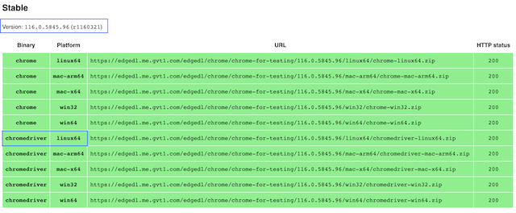

# Template Cucumber Java 🐞
Template de un proyecto de Cucumber con Java.

## Pré-requisitos

✅ Java 18
✅ Maven
✅ Browser Google Chrome
✅ Selenium WebDriver
- Chormedriver

### ⚠️ **Setup LOCAL Selenium WebDriver**

1. Comprueba qué versión de Google Chrome tienes instalada en tu máquina local


2. Accede al enlace https://googlechromelabs.github.io/chrome-for-testing/
3. Descargar el **chromedriver** según la versión de Google Chorme instalada



4. Extrae el archivo `.zip`
5. Mover el archivo `chromedriver` al directorio`/usr/local/bin`

```bash
sudo mv chromedriver /usr/local/bin
```

6. Ir al directorio `/usr/local/bin`

```bash
cd /usr/local/bin
```

7. Dar permiso de ejecución al `chromedriver`

```bash
chmod +x chromedriver 
```

8. Ver la versión de `chromedriver`

```bash
chromedriver --version
```

## Ejecución de pruebas

En la terminal, ejecute el siguiente comando:

```bash
mvn clean test
```

## Report

Para ver el informe de resultados de la prueba, vaya al directorio y abra el archivo en el navegador `template_cucumber.html` :
```bash
cd target/cucumber_reports 
```
